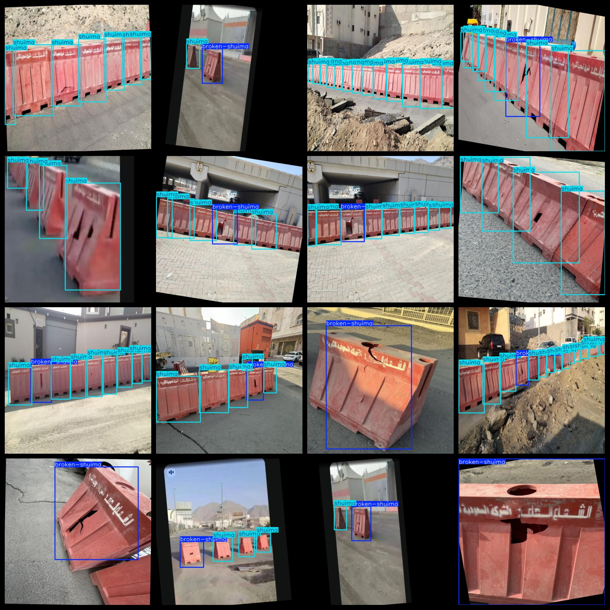

# Water Horse Damage Detection Dataset 205 imagesVOC+YOLO（Water-Filled Isolation Pier ）

Water Horse Damage Detection Dataset 205stretchVOC+YOLO（Water-Filled Isolation Pier ）

Dataset format: Pascal VOC format + YOLO format (the txt file does not contain the split path, it only contains jpg images and corresponding VOC format xml files and yolo format txt files)

Number of images (number of jpg files): 205

Number of annotations (number of xml files): 205

Number of annotations (number of txt files): 205

Label count: 2

The Github repository is: datasets_sl

Annotation class names: ["broken-shuima","shuima"]

Number of boxes labeled in each category:

broken-shuima frame count = 213

shuima frame count = 849

Total boxes: 1062

Number of images per category:

broken-shuima annotated images = 167

shuima annotated images = 146

Image Resolution: 512x512

Use the labeling tool: labelImg

Dataset Augmentation: Yes

Rules for annotation: Draw a rectangle around the category.

Important note: The dataset does not have been divided into training, validation, and testing sets.

Special Disclaimer: This dataset does not guarantee the accuracy of the trained models or weight files.

Annotation and image details are as follows:

## Images

---

Here is a pay link on Stripe (https://buy.stripe.com/3cs8yP7sY87d0vu9AB). Please contact me lonlonago@foxmail.com after funding $89, and I will send you a complete data files, thank you!

